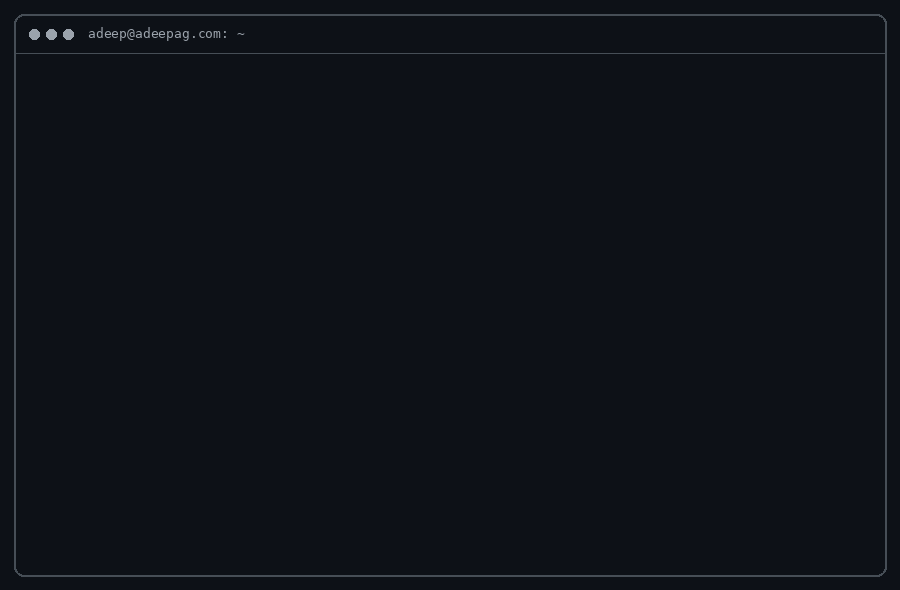

 

<a href="https://adeepag.com">🌐 Portfolio</a> &nbsp;•&nbsp;
<a href="https://blog.adeepag.com">✍️ Blog</a> &nbsp;•&nbsp;
<a href="https://adeepag.com/assets/resume.pdf">📄 Resume</a> &nbsp;•&nbsp;
<a href="https://adeepag.com/contact.html">📬 Contact</a>

  

---

## 👋 About

Engineering student and open-source developer from Bengaluru. I started with websites, then spent four years going deeper into backend, electronics and security. I like building from scratch, and I'm aiming at tech startups, especially in defense tech.

## 🛠️ Projects

| Project | What it is |
| :-- | :-- |
| [**ALogin**](https://github.com/ADEEP13/alogin) | Lightweight authentication library |
| **Novichok** | OSINT / defence-tech project, [details here](https://adeepag.com/projects.html) |
| [**gojo-bot**](https://github.com/ADEEP13/gojo-bot) | Bot project |
| [**adeepag**](https://github.com/ADEEP13/adeepag) | Source of my portfolio site |

More on the [projects page](https://adeepag.com/projects.html).

## 🏆 Highlights

- 🥇 Won 2 hackathons in my first year of engineering
- 📜 Patents filed for my inventions

---

  building something from scratch… <a href="https://adeepag.com/contact.html">say hi</a>

